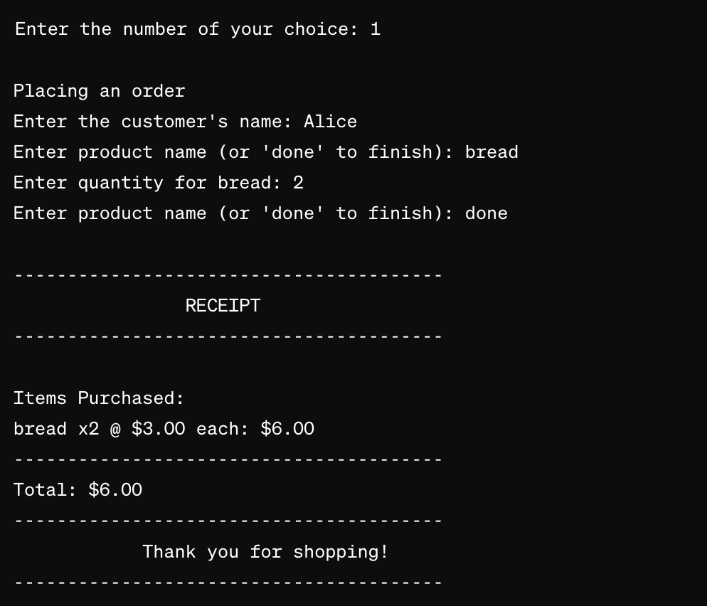

## CASH REGISTER/RETAIL MANAGEMENT SYSTEM 

## OVERVIEW
This project is a command-line based cash register system developed while learning Python. It allows for the management of customer orders, product listings, and member discounts within a retail context. Designed to run as a standalone Python script, it emphasizes a functional programming style.

## FEATURES
- Place orders for multiple products.
- Add or update product information.
- View a list of all customers and members.
- Apply discounts for members.
- Generate and display order receipts.

## REQUIREMENTS
Python 3.x. No external libraries are required except for sys, ensuring compatibility with a wide range of systems.

## SETUP + EXECUTION
1. Download the cash_register.py file to your local machine.
2. Open a terminal or command prompt.
3. Navigate to the directory containing cash_register.py.
4. Execute the script using Python by running: python cash_register.py.
5. Follow the on-screen prompts to interact with the system.

## USAGE INSTRUCTIONS
- Place an Order: Select option 1 from the main menu and follow the prompts to enter customer details, product selection, and quantity.

- Add/Update Products and Prices: Select option 2 to enter new product details or update existing ones.

- View Customers: Select option 3 to display a list of all customers.

- View Members: Select option 4 for a list of all members.

- View Products: Select option 5 to see all available products and their prices.

- Exit: Select option 0 to exit the system.

## KNOWN ISSUES
- The system currently does not support persistent storage, so all data is lost upon exit.

## FUTURE IMPROVEMENTS
- Implement persistent storage for customers, members, and product information.
- Extend the functionality to support batch processing of orders.

## LICENCE
This project is developed for educational purposes and is not intended for commercial use. Feel free to explore, modify, and share it within the confines of academic and personal use.

